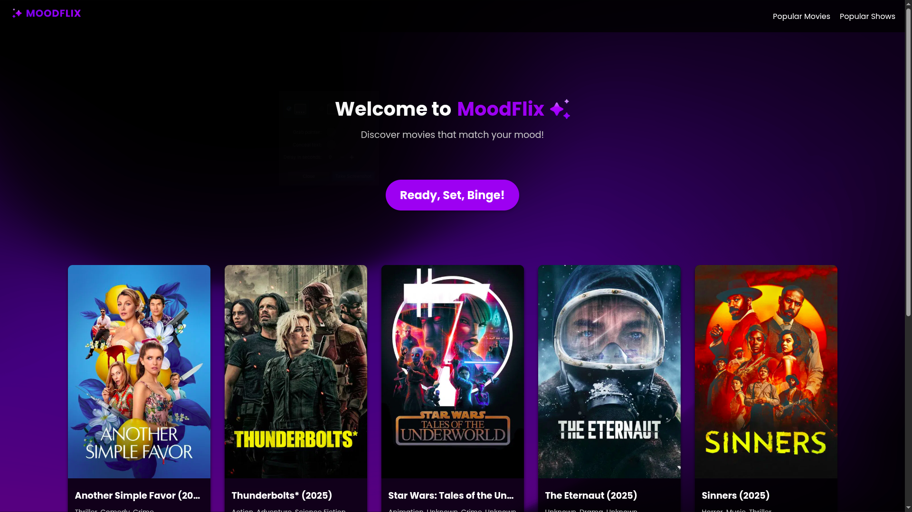

# 🎬 Mood-Based OTT Recommendation System



## 🔍 Project Objective

This project aims to develop a **smart recommendation system for OTT platforms** that suggests content based on a user's current **emotional state**. Instead of relying solely on watch history or popularity, our system focuses on the **mood** of the user, detected through various input modalities.

## 💡 Key Features

- **Multimodal Emotion Detection**:
  - **Speech to Emotion**: Uses voice input to classify emotional tone.
  - **Text to Emotion**: Analyzes user text input to infer emotion.
  - **Video to Emotion**: (Optional extension) Uses facial expressions to detect mood.

- **Unified Mood Vector Representation**:
  - Detected emotions are converted into a vector format with **7 universal emotional categories**:
    - `angry`, `happy`, `sad`, `disgust`, `surprised`, `fear`, `neutral`

- **Content Recommendation**:
  - Movie descriptions from the **TMDB dataset** are converted into vector representations.
  - Using **similarity comparison**, we recommend movies that best align with the detected emotional vector of the user.

## ⚙️ How It Works

1. User provides an input (text, audio, or video).
2. The input is processed and classified into one of the 7 emotions.
3. The system compares this emotion vector with pre-processed vectors of movie descriptions.
4. Movies with the **highest similarity scores** are recommended.

## 📦 Data Sources

- **Emotion Datasets**:
  - Audio: RAVDESS (or similar)
  - Text: Pre-labeled emotional texts
  - Video: FER+ or similar datasets (optional)

- **Movie Metadata**:
  - TMDB (The Movie Database) dataset for movie descriptions and metadata

## 🔮 Future Enhancements

- Integrate user history for hybrid recommendations
- Use transformer models for more accurate emotion classification
- Support for real-time video-based mood tracking

## 🤝 Team Contribution

This project was collaboratively built with a focus on deep learning, natural language processing, audio processing, and vector-based recommendation systems.


# Speech Emotion Recognition with Bagging Classifier and Other Models

## Introduction
This project implements a Speech Emotion Recognition (SER) system that detects human emotions from speech using various machine learning and deep learning models. The models are trained on audio datasets, saved in `.pkl` format using `joblib`, and later loaded for emotion prediction.

## Features
- **Emotion Detection**: Classifies emotions such as happy, sad, angry, neutral, and more.
- **Multiple Models**: Supports Bagging Classifier, MLP, and RNN-based models.
- **Model Persistence**: Saves trained models in `.pkl` format for reuse.
- **Feature Extraction**: Extracts MFCC, Chroma, and MEL spectrogram features from audio files.

## Requirements
- Python 3.6+
- Install dependencies using:
  ```bash
  pip install -r requirements.txt
  ```

## Usage
### Training
1. Train the model using one of the training scripts:
   - For Bagging Classifier:
     ```bash
     python train_NO_MODEL.py
     ```
   - For MLP:
     ```bash
     python train_MLP.py
     ```
   - For RNN:
     ```bash
     python train_RNN.py
     ```

2. The trained model will be saved in `.pkl` format (e.g., `saved_model_NO_MODEL.pkl`).

### Prediction
1. Use the corresponding test script to load the saved model and predict emotions:
   - For Bagging Classifier:
     ```bash
     python test_NO_MODEL.py
     ```
   - For MLP:
     ```bash
     python test_MLP.py
     ```
   - For RNN:
     ```bash
     python test_RNN.py
     ```

2. Example of loading a saved model and predicting:
   ```python
   from joblib import load
   from emotion_recognition import EmotionRecognizer

   # Load the saved model
   loaded_model = load('saved_model_NO_MODEL.pkl')
   rec_loaded = EmotionRecognizer(model=loaded_model, emotions=['happy', 'sad', 'neutral'], verbose=0)

   # Predict emotion
   prediction = rec_loaded.predict('path/to/audio.wav')
   print(f"Prediction: {prediction}")

   # Predict probabilities
   probs = rec_loaded.predict_proba('path/to/audio.wav')
   print(probs)
   ```

## Example
```python
from joblib import load
from emotion_recognition import EmotionRecognizer

# Load the saved Bagging Classifier model
loaded_model = load('saved_model_NO_MODEL.pkl')
rec_loaded = EmotionRecognizer(model=loaded_model, emotions=['happy', 'sad', 'neutral'], verbose=0)

# Predict emotion
prediction = rec_loaded.predict('data/validation/Actor_16/16_01_02_02_kids-talking_disgust.wav')
print(f"Prediction: {prediction}")

# Predict probabilities
probs = rec_loaded.predict_proba('data/validation/Actor_16/16_01_02_02_kids-talking_disgust.wav')
print(probs)
```

## Datasets
- **RAVDESS**: Emotional speech and song dataset.
- **TESS**: Toronto Emotional Speech Set.
- **EMO-DB**: Berlin Database of Emotional Speech.
- **Custom Dataset**: Add your own audio files for training and testing.

## Datasets Used
This project utilizes the following datasets for training and testing:

- **RAVDESS**: The Ryerson Audio-Visual Database of Emotional Speech and Song, which contains emotional speech and song recordings.
- **TESS**: The Toronto Emotional Speech Set, a dataset of emotional speech recordings.
- **EMO-DB**: The Berlin Database of Emotional Speech, which includes recordings in German with various emotions.
- **Custom Dataset**: A user-defined dataset located in the `data/train-custom` and `data/test-custom` directories, allowing for flexibility in training and testing with personalized data.

## Algorithms Used
- **Bagging Classifier**: Ensemble learning for robust classification.
- **MLP (Multi-Layer Perceptron)**: Neural network-based classifier.
- **RNN (Recurrent Neural Network)**: Deep learning model for sequential data.

## Highlighted Details
- **Training Scripts**:
  - `train_NO_MODEL.py`: Trains the Bagging Classifier.
  - `train_MLP.py`: Trains the MLP model.
  - `train_RNN.py`: Trains the RNN model.

- **Testing Scripts**:
  - `test_NO_MODEL.py`: Tests the Bagging Classifier.
  - `test_MLP.py`: Tests the MLP model.
  - `test_RNN.py`: Tests the RNN model.

- **Model Persistence**:
  - Models are saved in `.pkl` format using `joblib` for easy reuse.
  - Example: `saved_model_NO_MODEL.pkl` is used in `test_NO_MODEL.py` for predictions.


